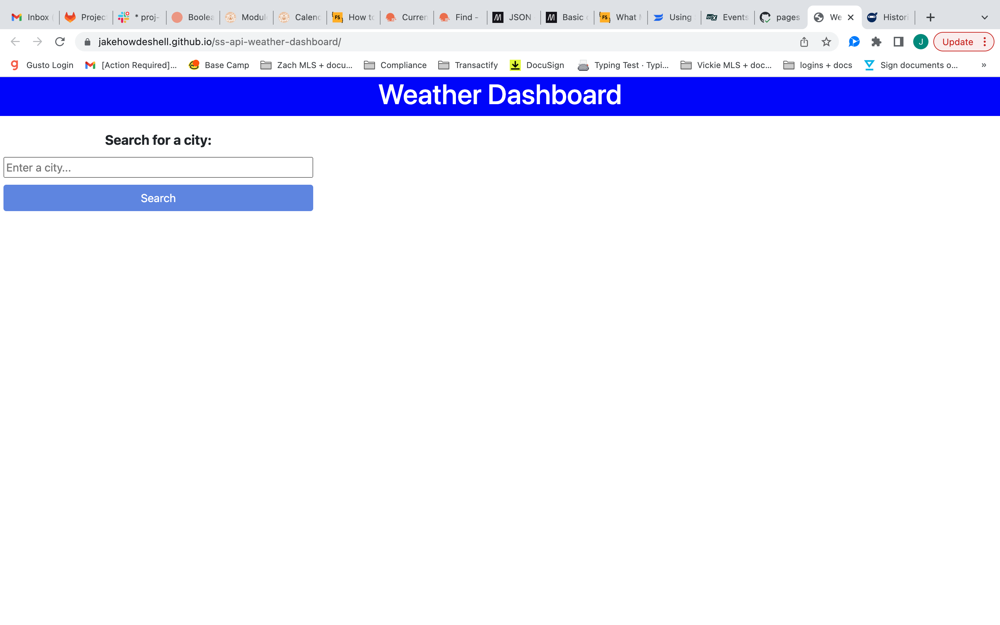
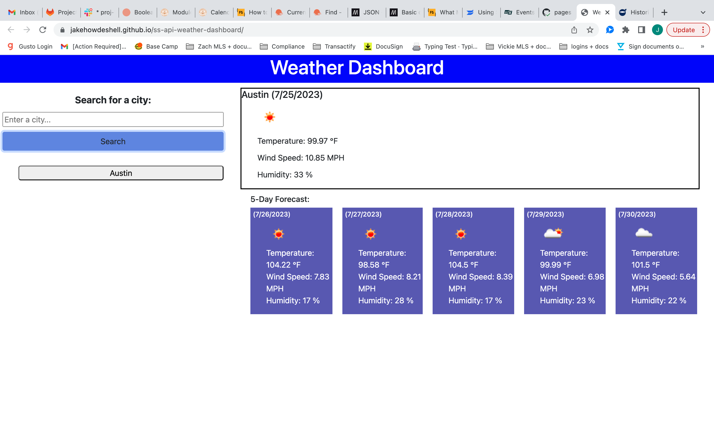
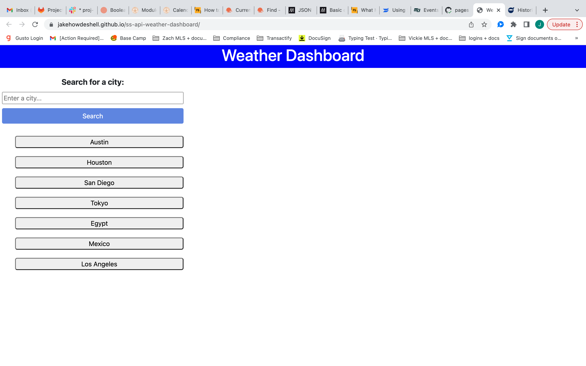
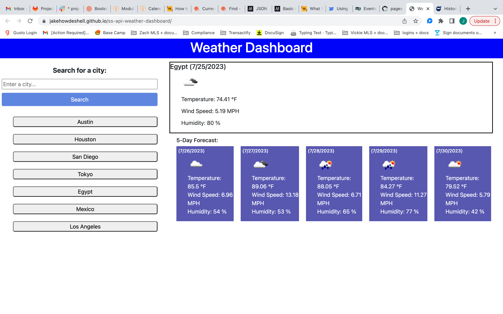

## Project Title

ServerSide API Weather DashBoard

## Project Description

AS A traveler
I WANT to see the weather outlook for multiple cities
SO THAT I can plan a trip accordingly

GIVEN a weather dashboard with form inputs
WHEN I search for a city
THEN I am presented with current and future conditions for that city and that city is added to the search history

A function called formSubmit allows for the user to add a city name and calls the function getWeather which makes a fetch from the OpenWeatherMap API and calls three functions, currentWeather & futureWeather which adds selected data from the API to the HTML page, and saveSearches which adds the city name to Local Storage which calls displaySearches showing the city names on the HTML page as a button with a click event listener that calls the getWeather function again using the stored city name.

WHEN I view current weather conditions for that city
THEN I am presented with the city name, the date, an icon representation of weather conditions, the temperature, the humidity, and the the wind speed

This data is pulled from the API and set into variables inside the getWeather function and called again in the display function, currentWeather, where it is displayed on the page.

WHEN I view future weather conditions for that city
THEN I am presented with a 5-day forecast that displays the date, an icon representation of weather conditions, the temperature, the wind speed, and the humidity

This data This data is pulled from the API and set into variables inside the getWeather function and called again in the display function, futureWeather, where it uses a for loop to go through the array provided by OpenWeatherMap and display the content on the page.

WHEN I click on a city in the search history
THEN I am again presented with current and future conditions for that city

A click event listener inside the displaySearch function calls the getWeather function when activated using the city text content displayed on the button.

## Screenshots

## Deployed Webpage

https://jakehowdeshell.github.io/ss-api-weather-dashboard/
